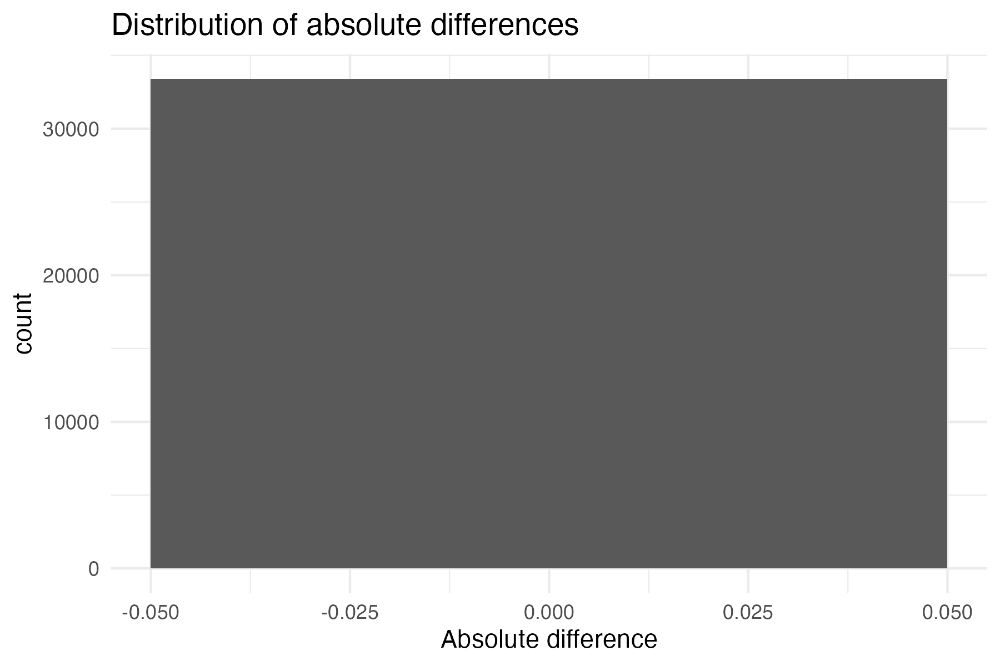
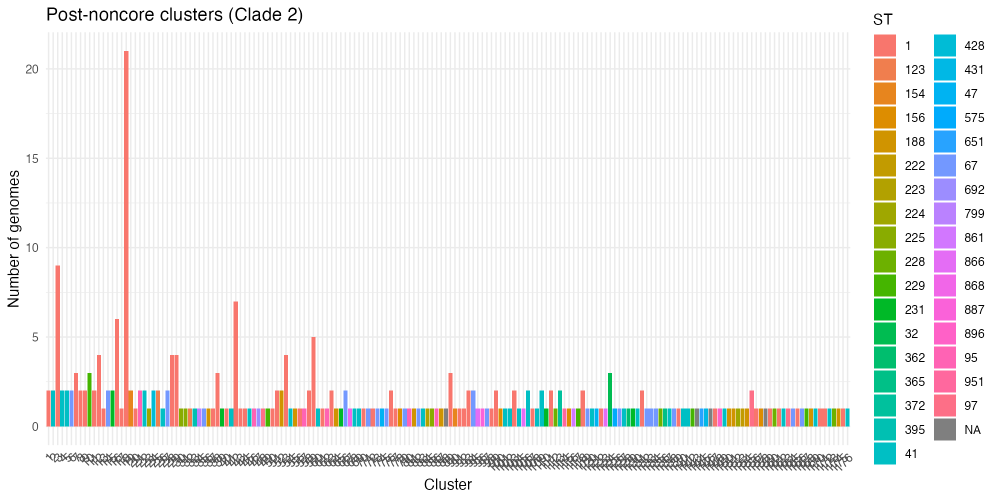
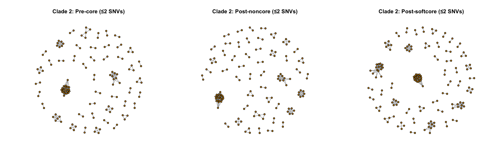
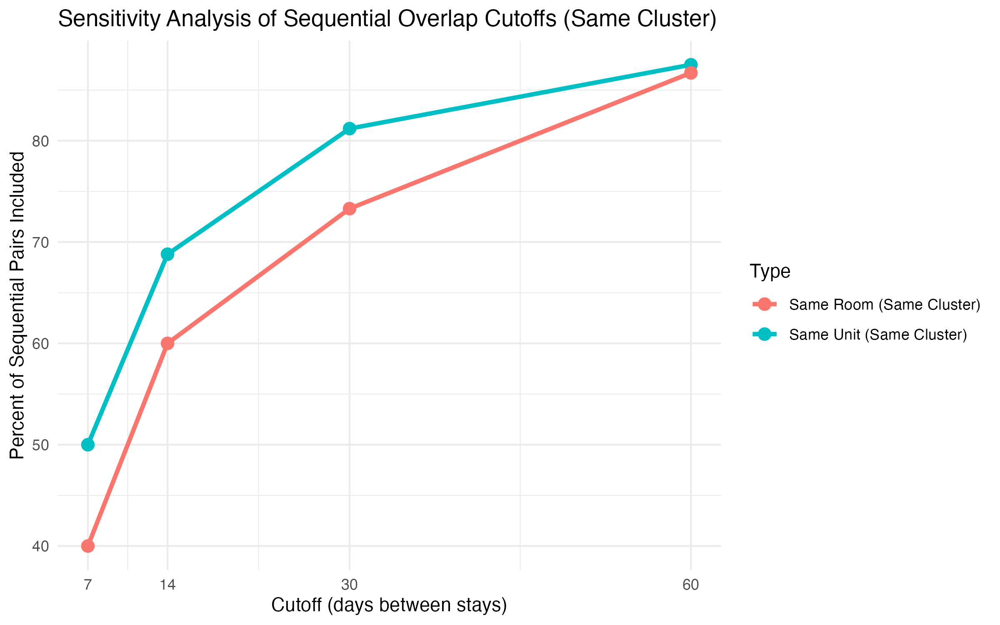

# Project Summary

This document is a reviewer-friendly walkthrough of a genomic epidemiology project focused on *Clostridioides difficile* transmission at the University of Michigan. The project combined whole-genome alignment processing, SNV distance calculation, cluster analysis, and patient/location metadata integration to study how closely related isolates map onto possible epidemiologic overlap.

The technical work spans pipeline design, comparative filtering strategies, analysis notebooks, statistical summaries, and visualization. Rather than showing only final plots, this portfolio highlights how the analysis was structured and implemented.

This repository includes both a curated portfolio layer and a full code-only mirror of the original project so reviewers can choose either a guided overview or the broader working codebase.

# Main Question

The core question was how different SNV distance definitions and filtering choices affect transmission-oriented interpretation, especially:

1. strict core distances
2. soft-core distances that tolerate limited missingness
3. non-core distances based on pairwise overlap
4. downstream clustering and overlap summaries tied to patient movement and location data

# Repository Guide

- `scripts/r/SNV_Pipeline_design.Rmd` explains the modular pipeline design and assumptions.
- `scripts/r/run_snv_pipeline.R` is the main executable wrapper for the SNV pipeline.
- `scripts/r/snv_pipeline_skeleton.R` contains the modular helper functions.
- `scripts/r/cdiff_cognac_070125.R` shows a project-specific `cognac` run used for core-gene alignment and distance generation.
- `code/README.md` and the numbered files in `code/` provide a one-step-per-file review path through the project.
- `source_code/` is a code-only mirror of the original project folder for reviewers who want the full working script tree rather than just the curated subset.
- `scripts/r/2025-07-22_Preliminary_results_on_patient_and_location_data.Rmd` shows the earlier descriptive and metadata exploration.
- `scripts/r/build_pair_table.Rmd` shows how pairwise SNV results were transformed into case/control-style analysis tables.
- `scripts/qmd/compare_core_vs_soft-core_non_core_distances_ST1_clade2_R20291.qmd` demonstrates a concrete comparison workflow on one clade/reference combination.
- `scripts/slurm/submit_snv_pipeline.slurm` shows how the pipeline was dispatched on compute infrastructure.

# Step-by-Step Code Path

If a reviewer wants the smallest possible code tour, the best path is:

1. `code/01_qc_and_assembly_review.sh`
2. `code/02_variant_calling_with_snpkit.sh`
3. `code/03_core_gene_alignment_with_cognac.R`
4. `code/04_patient_metadata_overview.R`
5. `code/05_alignment_filtering_and_qc.R`
6. `code/06_compare_distance_definitions.R`
7. `code/07_build_case_control_pairs.R`
8. `code/08_cluster_overlap_analysis.R`
9. `code/09_submit_snv_pipeline.slurm`

This layer is intentionally smaller than `source_code/`. Each file captures one step or one analysis rather than the full exploratory history.

# Project Workflow

## 1. Metadata and Descriptive Exploration

One branch of the work focused on patient demographics, onset type, location data, and sequence type distributions. This created the epidemiologic context needed to interpret later genomic results.

Small code file for this step: `code/04_patient_metadata_overview.R`

Representative notebook:

```r
ids <- read_csv(here('data','metadata','cleaned_passed_genomeid.csv'), col_names = FALSE)$X1

patient_data <- read_csv(here("data","metadata", "hospital_onset_data.csv")) %>%
  filter(genome_id %in% ids)

mlst_data <- read_tsv(here("data", "metadata", "mlst_replaced.tsv")) %>%
  mutate(ST = str_remove(ST, "\\*"))

main_wiens <- read_tsv(here("data", "metadata", "main_from_wiens_group_filtered_cdiff_cases.tsv")) %>%
  arrange(PatientID, Date)
```

This phase produced summary plots of sequence types, onset status, and patient timelines.

### Available Output Figures


## 2. Upstream QC and Assembly Review

Before any custom SNV analysis, the project started with quality control and assembly review. For this stage I relied on Snitkin Lab QC workflows, especially [`QCD`](https://github.com/Snitkin-Lab-Umich/QCD) for Illumina WGS QC and [`pubQCD`](https://github.com/Snitkin-Lab-Umich/pubQCD) for public-dataset style QC and download workflows.

Small code file for this step: `code/01_qc_and_assembly_review.sh`

Representative QC-oriented commands:

```bash
snakemake -s workflow/download_genomes.smk --dryrun -p

sbatch bash_script_to_download_and_run_raw_reads_pubQCD.sbat
```

Representative QC criteria documented for related Snitkin Lab workflows:

- contig count between 10 and 500
- coverage greater than 20X
- assembly size no greater than 7 Mb

This stage filtered out poor assemblies before downstream variant calling, clustering, and overlap analysis.

## 3. Variant Calling and Alignment Preparation with `snpkit`

After QC, I used [`snpkit`](https://github.com/alipirani88/snpkit) as part of the reference-based microbial variant-calling workflow. In practice, this stage handled read mapping, variant calling, filtering, and generation of the matrices and alignments used for later comparison work.

Small code file for this step: `code/02_variant_calling_with_snpkit.sh`

Representative usage pattern:

```bash
python snpkit/snpkit.py \
  -type PE \
  -readsdir /Path-To-Your/test_readsdir/ \
  -outdir /Path/test_output_core/ \
  -analysis output_prefix \
  -index KPNIH1 \
  -steps call \
  -cluster cluster \
  -scheduler SLURM \
  -clean
```

```bash
python snpkit/snpkit.py \
  -type PE \
  -readsdir /Path-To-Your/test_readsdir/ \
  -outdir /Path/test_output_core/ \
  -analysis output_prefix \
  -index reference.fasta \
  -steps parse \
  -cluster cluster \
  -gubbins yes \
  -scheduler SLURM
```

This produced the variant and alignment inputs that later fed the custom R-based SNV comparison pipeline.

## 4. Core-gene Alignment and Phylogenetic Context with `cognac`

Alongside the variant-calling workflow, I also used [`cognac`](https://github.com/Snitkin-Lab-Umich/cognac) for core-gene alignment, phylogenetic context, and distance generation. This is reflected directly in the local project history, where a dedicated `2025-07-01_cognac` analysis branch produced phylogenetic trees, ST summaries, and heatmap outputs that supported downstream interpretation.

Small code file for this step: `code/03_core_gene_alignment_with_cognac.R`

Representative project-specific use:

```r
library(tidyverse)
library(cognac)

ids = read_csv("/nfs/turbo/umms-esnitkin/Project_Cdiff/Analysis/2025-sysbio-UM-transmission-Skylar/data/metadata/passed_ids.csv")
isolate_ids = ids$isolate_id

fasta_files = paste0("/nfs/turbo/umms-esnitkin/Project_Cdiff/Sequence_data/assembly/illumina/prokka/", isolate_ids, "/", isolate_ids, ".fna")
gff_files   = paste0("/nfs/turbo/umms-esnitkin/Project_Cdiff/Sequence_data/assembly/illumina/prokka/", isolate_ids, "/", isolate_ids, ".gff")

algnEnv = cognac(
  fastaFiles = fasta_files,
  featureFiles = gff_files,
  keepTempFiles = TRUE,
  outDir = outDir,
  minGeneNum = 500,
  maxMissGenes = 0.05,
  threadVal = 18,
  njTree = TRUE
)
```

This provided broader sequence context that complemented the stricter reference-based SNV comparisons.

## 5. Modular SNV Pipeline Design

The most technically important part of the project was a modular R pipeline for computing SNV distances from whole-genome alignments. The design explicitly separated:

Small code file for this step: `code/05_alignment_filtering_and_qc.R`

- alignment reading
- missingness summaries
- genome filtering
- site filtering
- strict core, soft-core, and non-core distance calculations
- QC summaries and exports

Representative design excerpt:

```r
identify_core_sites <- function(valid_matrix, threshold = 1.0) {
  n_genomes <- ncol(valid_matrix)
  prop_valid <- rowMeans(valid_matrix)
  prop_valid >= threshold
}

compute_snv_distances <- function(dnabin, core_sites = NULL) {
  if (!is.null(core_sites)) {
    sub_dnabin <- dnabin[, core_sites, drop = FALSE]
    dist_obj <- ape::dist.dna(sub_dnabin, model = "N", pairwise.deletion = FALSE)
  } else {
    dist_obj <- ape::dist.dna(dnabin, model = "N", pairwise.deletion = TRUE)
  }
  as.matrix(dist_obj)
}
```

This design made it possible to compare how different filtering strategies changed downstream pairwise distances.

## 6. Pipeline Execution Wrapper

The reusable helper functions were then wrapped in a top-level executable script with command-line arguments for alignments, masking inputs, secondary isolates, output directories, and threshold settings.

Small code file for this step: `code/09_submit_snv_pipeline.slurm`

Representative wrapper excerpt:

```r
opt <- list(
  pre = NULL,
  post = NULL,
  gubbins_masked = NULL,
  ref_id = NULL,
  secondary_isolates = NULL,
  genome_missing_threshold = 0.10,
  soft_core_threshold = 0.90,
  soft_core_thresholds = "1.0,0.95,0.9,0.85,0.8",
  mask_post_based_on_pre = FALSE,
  outdir = "snv_pipeline_output"
)
```

The HPC entrypoint used a SLURM batch script:

```bash
#!/bin/bash
#SBATCH --job-name=snv_pipeline
#SBATCH --output=%x-%j.out
#SBATCH --error=%x-%j.err
#SBATCH --time=12:00:00
#SBATCH --cpus-per-task=8
#SBATCH --mem=128G

Rscript 2026_analysis/run_snv_pipeline.R \
  --pre "$PRE" \
  --post "$POST" \
  --gubbins_masked "$GUBBINS_MASK" \
  --ref_id cdiff_R20291_ref_genome \
  --secondary_isolates "$SECONDARY" \
  --outdir "$OUTDIR" \
  --genome_missing_threshold 0.10 \
  --soft_core_threshold 0.90 \
  --soft_core_thresholds 1.0,0.95,0.9,0.85,0.8 \
  --mask_post_based_on_pre
```

## 7. Core vs Soft-core vs Non-core Comparison

Another major analysis stream compared distance definitions directly on real alignments. This work examined how many pairs changed when moving from strict core to soft-core filtering and then to non-core pairwise deletion.

Small code file for this step: `code/06_compare_distance_definitions.R`

Representative analysis excerpt:

```r
var_dist_core     <- dist.dna(aln_var, pairwise.deletion = FALSE, model = "N")
var_dist_noncore  <- dist.dna(aln_var, pairwise.deletion = TRUE,  model = "N")

aln_var_soft      <- soft_core_filter(aln_var, threshold = 0.05)
var_dist_softcore <- dist.dna(aln_var_soft$aln, pairwise.deletion = TRUE, model = "N")
```

Those results were exported as matrices and long-form tables for downstream merging with metadata and for direct visual comparison.

### Available Output Figures




## 8. Cluster Analysis

After generating pairwise distances, the project grouped closely related isolates into clusters and compared how cluster structure changed across pre-core, post-softcore, and post-noncore pipelines.

This work produced cluster summaries, adjacency graphs, and cluster size/range summaries for clade-specific analyses.

### Available Output Figures






## 9. Pair Table and Case-Control Style Comparisons

A later stage converted pairwise SNV outputs into analysis-ready pair tables, especially for clade-specific case/control-style comparisons within sequence type.

Small code file for this step: `code/07_build_case_control_pairs.R`

Representative excerpt:

```r
create_pair_table <- function(snv_col, pipeline_name) {
  pairs <- snv_with_st %>%
    mutate(snv = .data[[snv_col]]) %>%
    select(id1, id2, st, snv) %>%
    filter(!is.na(snv)) %>%
    mutate(
      case_control = case_when(
        snv <= snv_case_threshold ~ "case",
        snv > snv_control_threshold_1 ~ "control_gt10",
        TRUE ~ NA_character_
      )
    ) %>%
    filter(!is.na(case_control)) %>%
    mutate(pipeline = pipeline_name)
}
```

This stage connected the SNV calculations to a more interpretable epidemiologic design.

## 10. Sequential and Spatial Overlap Analysis

The project also examined whether genetically close isolates shared room or unit overlap patterns, and whether overlap signals differed across cluster definitions and pipelines.

Small code file for this step: `code/08_cluster_overlap_analysis.R`

Representative outputs included unit- and room-based overlap summaries, sequential overlap plots, and sensitivity analyses.

### Available Output Figures




## 11. Communication and Reporting

The project was not just an internal codebase. It also produced lab meeting slides, HTML notebooks, and reports to communicate intermediate findings and design choices.

### Slide Preview


# Technical Highlights

- Designed a reusable R-based SNV distance pipeline rather than one-off analysis code.
- Integrated upstream QC, variant-calling, and core-gene alignment workflows with custom project analysis code.
- Compared multiple genome-wide distance definitions under different missingness rules.
- Integrated genomic distances with patient, room, unit, onset, and sequence-type metadata.
- Produced cluster-based and overlap-based outputs suitable for transmission interpretation.
- Structured analyses across notebooks, scripts, helper libraries, and SLURM execution.

# Notes

- This is a curated portfolio version of the project, not the entire working directory.
- Large FASTA alignments and sensitive/private metadata are intentionally not duplicated here.
- Some absolute paths remain in the copied scripts because they document the original working environment.
