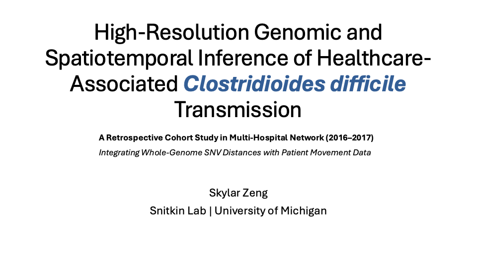
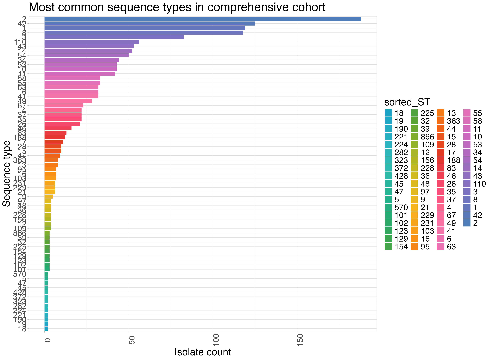
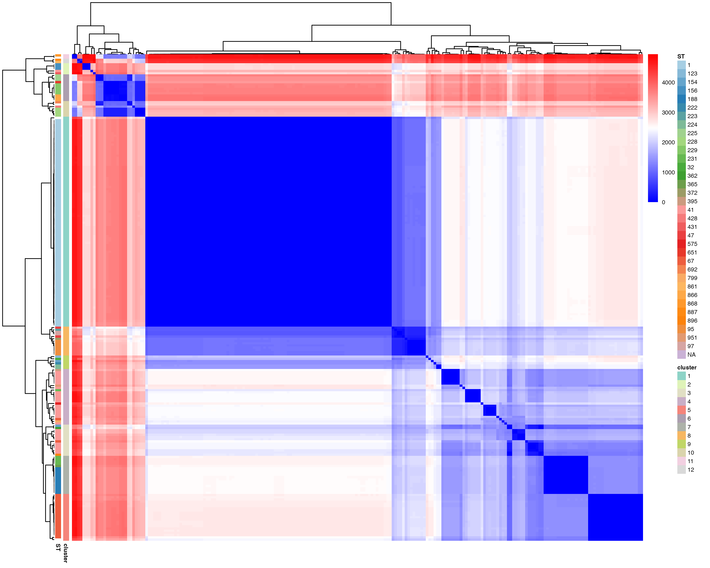
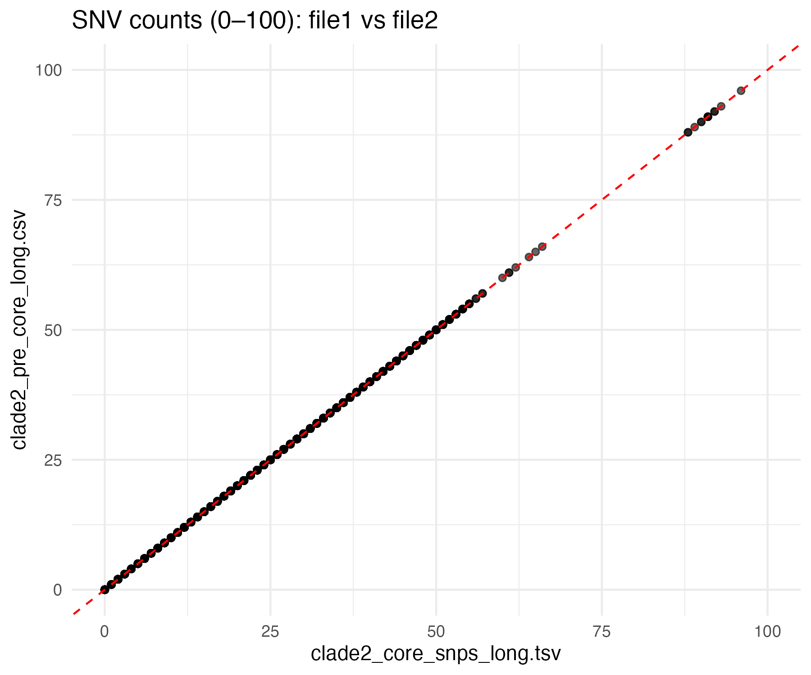
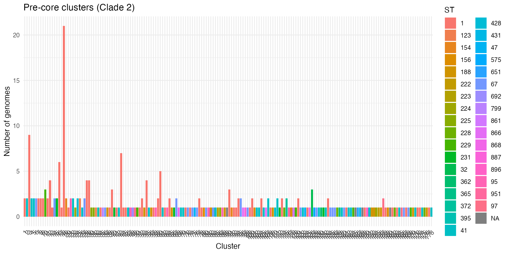
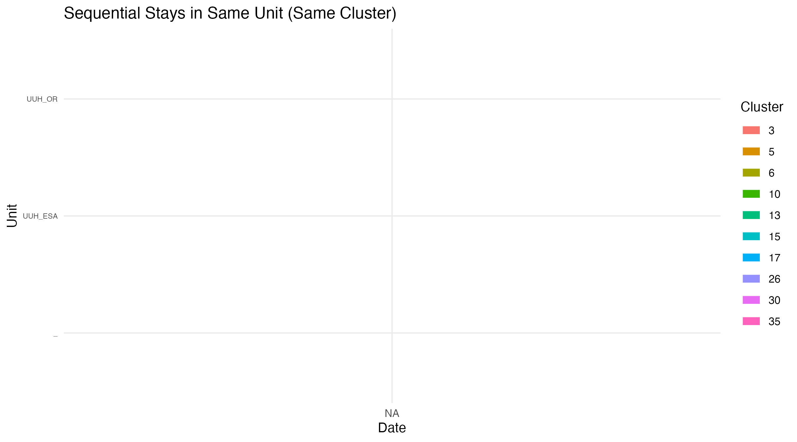
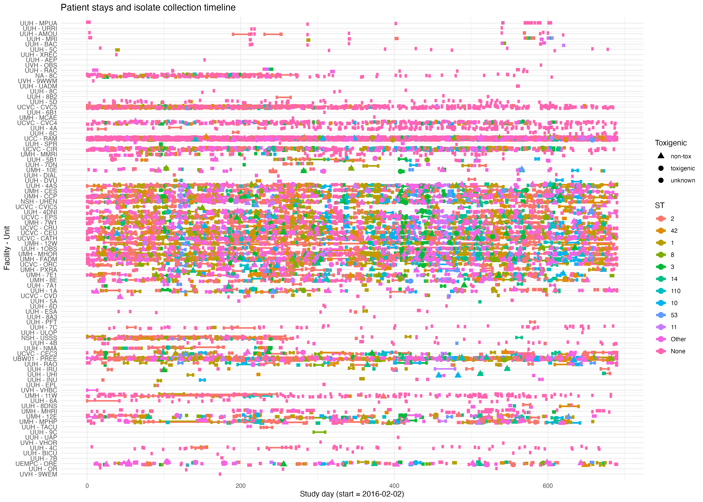

# C. difficile UM Transmission Portfolio

This repository includes a representative genomic epidemiology project on *Clostridioides difficile* transmission. It highlights SNV distance pipeline design, clade-level clustering, patient/location overlap analysis, and the connection between genomic distances and hospital metadata.

If you want the full story in one file, start with `PROJECT_OUTLINE.md`.

## What This Repo Shows

- `PROJECT_OUTLINE.md`: single-file walkthrough of the project, methods, code, and outputs
- `scripts/`: main curated code package, organized similarly to the metagenomics portfolio
- `code/`: refined step-by-step code layer with one small file per project stage
- `source_code/`: mirrored code-only copy of the original project folder, preserving the broader working script and notebook tree
- `docs/0410_labmeeting_slides.pdf`: presentation used to communicate intermediate findings
- `figures/`: representative output plots from the project
- `data_summaries/`: selected summary tables used to interpret results

## Technical Focus

- modular SNV distance pipeline design in R
- pre- and post-Gubbins comparison of core, soft-core, and non-core distances
- metadata integration across genomes, patients, sequence types, and locations
- cluster visualization and overlap analysis
- HPC execution through R scripts and SLURM
- staged descriptive-analysis scripts for cluster and location workflows
- integration of upstream QC, variant-calling, and core-gene alignment workflows

## Upstream Workflow Components

Before the custom downstream SNV analysis in this repository, the project also used upstream genomics workflows as part of the end-to-end process:

- [`cognac`](https://github.com/Snitkin-Lab-Umich/cognac): used for core-gene alignment and phylogenetic context
- [`QCD`](https://github.com/Snitkin-Lab-Umich/QCD) and [`pubQCD`](https://github.com/Snitkin-Lab-Umich/pubQCD): used for QC and assembly-review steps in the broader analysis workflow
- [`snpkit`](https://github.com/alipirani88/snpkit): used for microbial variant calling, QC outputs, and alignment generation steps feeding downstream SNV analyses

Short, step-by-step versions of those stages are included in `code/`, while the fuller curated script set lives in `scripts/` so a reviewer can inspect the real project workflow in more depth without opening the full archive first.

## Full Code Archive

In addition to the curated portfolio files, this repository includes `source_code/`, a code-only mirror of the original `2025-sysbio-UM-transmission` project folder. That mirror preserves the broader working structure across:

- `2025-07-01_cognac/`
- `2025_analysis/`
- `2026_analysis/`
- `Cluster_visulization_clade2/`
- `variant_calling/`
- `blast/`, `lib/`, `reports/`, `scripts/`, and selected `IGV/` helper scripts

This lets a reviewer read the polished project summary first, then inspect the original working code in much more complete form if they want depth.

## Selected Visual Outputs

## Notes

- This portfolio is a curated subset of a much larger working analysis directory.
- The `source_code/` folder contains all code files from the source project, but not the raw data or large intermediate outputs.
- Large FASTA alignments, raw intermediate objects, and private metadata are not duplicated here.
- Absolute file paths are preserved in some scripts because they reflect the original working environment and HPC execution context.
